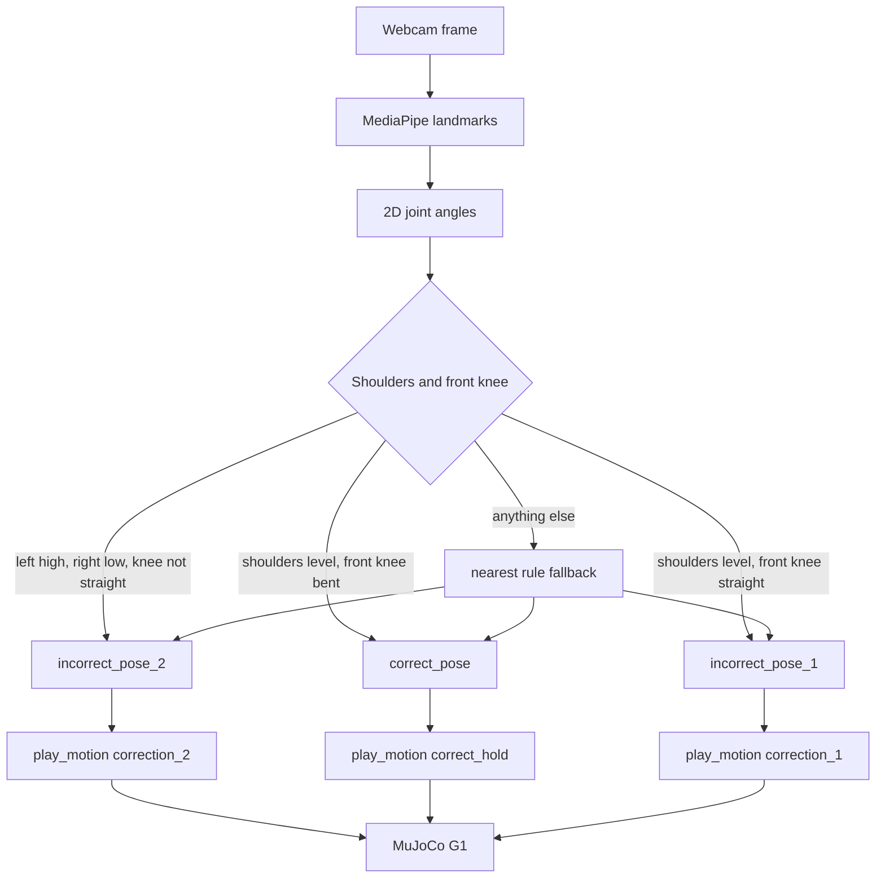

# Physical AI — a coach you can see

Most home yoga and training apps talk at you. This project is for the other gap: **seeing what you are doing, then showing you how to move.**

A future home setup is simple. You stand in front of a camera. Software reads your pose the way a teacher would — knees, shoulders, stance. If something is off, a humanoid (or a faithful simulation of one) **demonstrates the correction**, not a wall of text. The same idea scales to personal trainers: one coach in the room for Warrior II today, a whole session of cues tomorrow.

The real Unitree G1 is the long-term body of that coach. **MuJoCo is the safe test gym** so we can prove the loop before anyone stands next to a robot.

---

## Vision

| Today (hackathon MVP) | Next |
| --- | --- |
| One asana: **Warrior II** (Virabhadrasana II) | More poses, sequenced classes |
| Two common mistakes + one correct hold | A library of corrections per asana |
| Laptop webcam + on-screen G1 in MuJoCo | Same pipeline on the **real G1** |
| Prerecorded SONIC motions | Richer motion set, optional voice cues |
| Rule-based joint-angle coach | Still explainable; more people, more cameras |

Who it is for:

- **Yoga teachers at home** who want a consistent, visual correction instead of “a bit more in the front knee.”
- **Personal trainers** who want a second pair of eyes on alignment while they watch the rest of the session.
- **Students** who practice alone and need to *see* the path from their error to the target shape.

We do **not** train the humanoid in MuJoCo. The robot is an actor. Computer vision names the mistake; a prerecorded clip is the lesson.

---

## Current MVP

One live loop:

```text
person in front of a MacBook
        ↓
webcam
        ↓
MediaPipe pose landmarks
        ↓
angle rules  →  incorrect 1 | incorrect 2 | correct
        ↓
map to a named motion
        ↓
SONIC clip (or placeholder)
        ↓
MuJoCo Unitree G1 demonstrates the correction
```

**Warrior II, camera-front.** Either leg can be forward. Three shapes:

| What you are doing | What the G1 plays |
| --- | --- |
| Arms already level, **both knees straight** | `correction_1` — bend the front knee |
| Lunge already there, **arms on a diagonal** | `correction_2` — level the arms *(real SONIC clip)* |
| Front knee bent **and** arms in one line | `correct_hold` — stay |

If the pose is between strict bands (arms hanging, mid-bend, or mixed errors),
the system selects the nearest of those three rule regions. A detected person
therefore always receives one decision.

`correction_2` is the recorded clip in `sonic/yoga_instructor_humanoid/`. The other two names still use kinematic placeholders until those SONIC files exist.

We handed this SONIC pipeline off to the physical G1's owners, who agreed to
test it on the real robot and said they'd do their best — but we weren't able
to get footage back before the deadline, so the live robot has not been
validated end-to-end yet. Everything above has only been proven in MuJoCo.

Coach videos that define the two paths (no audio in the live demo yet):

- `pose_images/correction_incorrect_1.mov`
- `pose_images/correction_incorrect_2.mov`
- `pose_images/correct_holding.mov`

Alignment detail lives in [`docs/warrior2_pose2_to_pose3_requirements.md`](docs/warrior2_pose2_to_pose3_requirements.md).

---

## Technical stack

| Layer | What we use | Role |
| --- | --- | --- |
| Capture | MacBook webcam, OpenCV | Live frames |
| Perception | **MediaPipe** Pose Landmarker | 33 body landmarks |
| Coaching logic | **`pose_rules.py`** | Joint-angle decision table |
| Motion map | **`g1_sim/mapping.py`** | Pose label → clip name |
| Humanoid control | **SONIC** (NVIDIA / G1, 29 DoF) | Prerecorded whole-body motion |
| Simulation | **MuJoCo** + Menagerie G1 | Playback, not training |
| Glue | Python 3.11, ZMQ | Webcam process asks the sim to `play_motion` |
| Explore / debug | Jupyter notebook | Landmark and angle plots |

Supporting files: `pose_classifier.py` still has a photo-similarity embedding; live decisions **do not** use it. The overlay may show `embed:` only as a comparison.

---

## Flow and logic



**Why rules, not “closest photo.”** Correct vs incorrect 2 is almost entirely **shoulders** (about 92° / 73° vs 148° / 22°). Knees and elbows already match. Incorrect 1 is the opposite: shoulders already good, **front knee still straight**. A whole-body embedding buries that one joint in positional noise. The coach therefore:

1. Measures image-plane angles at shoulders and knees (same geometry as the notebook).
2. Treats **path B (incorrect 2)** as a diagonal arm line; the lunge can be slightly imperfect.
3. Treats **path A (incorrect 1)** as level arms plus a straight front knee (`left_knee > 165°`).
4. Treats **correct** as level arms plus a bent front knee (`left_knee ≤ 160°`).
5. Scores any pose outside those strict bands against all three rule regions
   and chooses the nearest one.
6. Never runs both correction scripts at once.

Elbows are not part of the live decision: in these three shapes they are already straight.

The interface to the robot stays tiny:

```python
pose = classify_webcam()          # pose_rules.classify_by_angles
play_motion(motion_for_pose(pose)) # "correction_2", "correction_1", or "correct_hold"
```

In this repo that call is ZMQ to a MuJoCo process. On the real G1 it can be the same name, a different transport.

---

## Setup

Do not commit `.venv`. From the repo root:

```bash
python3.11 -m venv .venv
source .venv/bin/activate
pip install -r requirements.txt
python -m g1_sim.fetch_model
```

In Jupyter / VS Code / Cursor, select the kernel from `.venv`.

Classify a still (rules + debug angles):

```bash
python pose_classifier.py pose_images/incorrect_2.jpg
```

Play a named clip on the G1 (macOS needs `mjpython` for a window):

```bash
mjpython play_motion.py correction_2
```

---

## Live demo (MacBook)

Two windows: webcam preview and simulated G1. No audio. Use **Terminal.app** for the camera (Camera permission: **System Settings → Privacy & Security → Camera → Terminal**).

**Terminal 1**

```bash
source .venv/bin/activate
mjpython play_motion.py --serve
```

**Terminal 2**

```bash
source .venv/bin/activate
python webcam_coach.py
```

Stand fully in frame, hips toward the camera.

- **Incorrect 2:** left knee bent, left arm high, right arm low → G1 plays the SONIC correction.
- **Correct:** left knee bent, both arms in one horizontal line → G1 holds.
- `--only-motion correction_2` limits the demo to the SONIC clip.
- `--dry-run` prints the mapping and does not talk to MuJoCo.

Press **q** in the webcam window to quit; **Ctrl+C** in Terminal 1 to stop the sim.

If the camera is denied: quit Terminal with **Cmd+Q**, reopen it, and run Terminal 2 again. If MuJoCo never moves, confirm the server printed `G1 motion server listening` and that you launched it with `mjpython`.

---

## Repo map

| Path | What it is |
| --- | --- |
| `pose_rules.py` | Live classification |
| `webcam_coach.py` | Camera → label → `play_motion` |
| `g1_sim/` | G1 player, mapping, motion loading |
| `play_motion.py` | CLI and ZMQ server |
| `sonic/` | Prerecorded G1 trajectories |
| `pose_images/` | Reference stills and teacher videos |
| `notebooks/mediapipe_smoketest.ipynb` | Landmarks and angles |
| `docs/warrior2_pose2_to_pose3_requirements.md` | Coaching spec |

---

## Integrated desktop coach

`coach_app.py` combines a continuously running live pose detector, snapshot
pose selection, an embedded MuJoCo render, and audio coaching cues in one large
window. Live predictions are previews only. Press the snapshot button, hold
the pose through the five-second countdown, and only the frame captured at
zero triggers its matching demonstration and audio cue.

One-time setup if the NVIDIA GEAR-SONIC checkout is not present under
`robotics/GR00T-WholeBodyControl`:

```bash
source .venv/bin/activate
python -m g1_sim.fetch_model
```

Launch the coach:

```bash
python coach_app.py
```

The default pose-to-motion/audio mapping is in `coach/actions.yaml`. Relative
motion and audio paths are resolved from the repository root. The knee and
shoulder decision bands are defined in `pose_rules.py`. Manual demonstration
buttons remain available for testing without taking a snapshot.

### If it does not fire

- `No person`: step back until your full body is visible.
- Camera error: close other apps using the camera and retry with
  `python coach_app.py --camera 0` (or the correct device index).
- Simulation error: confirm either the NVIDIA checkout exists at
  `robotics/GR00T-WholeBodyControl` or fetch the Menagerie model with
  `python -m g1_sim.fetch_model`.
- No sound: select a working output device for PortAudio or use the mute
  checkbox while testing motion playback.
